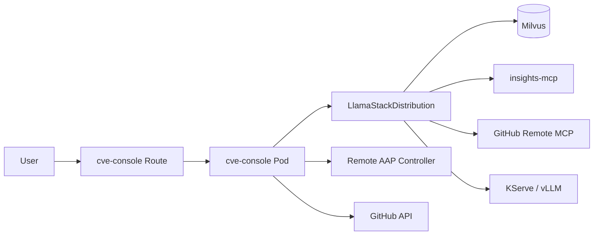

# OpenShift deploy (remote Ansible AAP)

Deploy the full stack on **OpenShift / RHOAI** with `cve-console`. **Ansible Automation Platform stays external** — reuse the same controller URL, token, and project/inventory IDs.

**New laptop or new cluster?** Start with **[NEW-MACHINE-CHECKLIST.md](NEW-MACHINE-CHECKLIST.md)** (one page), then return here for details.

## Architecture



| Component | Resource | Notes |
|-----------|----------|-------|
| Namespace | `agentic-patching` | All resources |
| Console | `deployment/cve-console` | UI :8787, logs on pod stderr |
| RAG ingest | `job/rag-ingest` | Uses **same console image** + sample CSV at `/app/` |
| Llama Stack | `LlamaStackDistribution` | RHOAI 0.7.x, PostgreSQL metadata |
| AAP | **External** | `AAP_BASE_URL` + `AAP_TOKEN` in secret |

## Prerequisites

1. OpenShift 4.14+ with `oc` logged in  
2. RHOAI / Llama Stack Operator — `oc get crd llamastackdistributions.llamastack.io`  
3. Default StorageClass for PVCs  
4. KServe or external vLLM for `llama-scout-17b`  
5. Network from cluster → **remote AAP** HTTPS URL  
6. Outbound HTTPS: GitHub, `console.redhat.com`, `sso.redhat.com` (CVE REST mode)

## 1. Configure secrets (env file — recommended)

Copy the example env file and fill in values. **Do not commit** `openshift/.env.openshift` (gitignored).

```bash
cp openshift/.env.openshift.example openshift/.env.openshift
# edit: AAP_TOKEN, AAP_BASE_URL, GIT_HUB_TOKEN, Lightspeed creds, VLLM_URL, VLLM_API_TOKEN
```

| Variable | Notes |
|----------|-------|
| `AAP_TOKEN` / `AAP_BASE_URL` | Same remote AAP controller |
| `AAP_DEFAULT_*` | Project/inventory/EE/org IDs on that AAP |
| `LIGHTSPEED_CLIENT_*` | Insights service account |
| `GIT_HUB_TOKEN` | PAT for playbook repo |
| `VLLM_URL` / `VLLM_API_TOKEN` | Inference on this cluster or external MaaS |

See `openshift/secrets/README.md` for secret names and keys. Example manifests: `openshift/secrets/*.yaml.example`.

For console non-secret config, edit `openshift/cve-console/configmap.yaml` (manual path below).

## 2. Full automated setup (recommended)

From **bundle root**:

```bash
chmod +x openshift/scripts/*.sh
./openshift/scripts/setup-openshift.sh
```

Options:

```bash
./openshift/scripts/setup-openshift.sh -y                    # skip confirmation
./openshift/scripts/setup-openshift.sh --skip-rag              # infra + console only
./openshift/scripts/setup-openshift.sh --skip-build            # image already built
./openshift/scripts/setup-openshift.sh --env-file /path/to/.env.openshift
```

The script: applies secrets → Milvus/MCP/LSD → detects `LLAMA_STACK_URL` → builds image → deploys console → runs RAG ingest → sets `VECTOR_DB_ID` → prints route URL.

## 3. Manual deploy (step-by-step)

Use this if you need finer control. Same end state as automation.

### Apply secrets

```bash
cp openshift/.env.openshift.example openshift/.env.openshift
# edit values
./openshift/scripts/apply-secrets.sh
```

### Console config (non-secret)

```yaml
AAP_DEFAULT_PROJECT_ID: "43"      # same remote AAP org
AAP_DEFAULT_INVENTORY_ID: "1"
AAP_DEFAULT_EXECUTION_ENVIRONMENT_ID: "2"
AAP_DEFAULT_ORGANIZATION_ID: "1"
AAP_VERIFY_TLS: "false"           # sandbox/self-signed AAP
CVE_CONSOLE_CVE_LIST_SOURCE: "direct_mcp"
VECTOR_DB_ID: ""                  # set after RAG ingest (step 6)
```

## 4. Deploy infrastructure (manual)

From **bundle root**:

```bash
chmod +x openshift/scripts/*.sh
./openshift/scripts/deploy.sh
```

Or: `oc apply -k openshift/`

Wait for Ready:

```bash
oc get pods -n agentic-patching
oc get llamastackdistribution agentic-patching-llsd -n agentic-patching
```

## 5. Llama Stack service URL

```bash
oc get svc -n agentic-patching | grep -E 'llama|llsd'
```

Update `openshift/llamastack/service-endpoint-configmap.yaml` if needed:

```yaml
LLAMA_STACK_URL: "http://agentic-patching-llsd-service:8321"
```

```bash
oc apply -k openshift/llamastack/
oc apply -k openshift/cve-console/
```

## 6. Build console + RAG image

Single image for console pod and RAG jobs:

```bash
./openshift/scripts/build-console-image.sh
oc rollout restart deployment/cve-console -n agentic-patching
oc rollout status deployment/cve-console -n agentic-patching --timeout=180s
```

Image: `agentic-patching-console:latest` (includes `cve-sample-historical-1000.csv` at `/app/`).

## 7. Verify remote AAP from pod

```bash
oc exec deploy/cve-console -n agentic-patching -- python3 - <<'PY'
import os, json, ssl, urllib.request
base = os.environ["AAP_BASE_URL"].split("/api/controller/")[0].rstrip("/")
tok = os.environ["AAP_TOKEN"]
ctx = ssl._create_unverified_context()
url = f"{base}/api/controller/v2/ping/"
req = urllib.request.Request(url, headers={"Authorization": f"Bearer {tok}"})
print(json.dumps(json.load(urllib.request.urlopen(req, context=ctx)), indent=2))
PY
```

## 8. RAG ingest (new cluster = new vector store)

```bash
oc delete job rag-ingest -n agentic-patching --ignore-not-found
oc apply -f openshift/jobs/rag-ingest-job.yaml -n agentic-patching
oc logs -f job/rag-ingest -n agentic-patching
```

Copy `vs_...` from job output → `openshift/cve-console/configmap.yaml`:

```yaml
VECTOR_DB_ID: "vs_xxxxxxxx-xxxx-xxxx-xxxx-xxxxxxxxxxxx"
```

```bash
oc apply -f openshift/cve-console/configmap.yaml -n agentic-patching
oc rollout restart deployment/cve-console -n agentic-patching
```

Re-index only (existing store): `oc apply -f openshift/jobs/rag-reindex-job.yaml`

## 9. Open console

```bash
oc get route cve-console -n agentic-patching \
  -o jsonpath='https://{.spec.host}{"\n"}'
```

1. **CVEs** tab — paginated list (`direct_mcp` by default)  
2. **Start Patch** on a CVE  
3. **Approve / Deny** when workflow hits approval gate  

## 10. Logs and manual flow

```bash
oc logs -f deploy/cve-console -n agentic-patching

oc exec deploy/cve-console -n agentic-patching -- \
  python3 /data/workspace/cve_flow.py --cve CVE-2020-25681
```

## Hot-fix scripts (without image rebuild)

```bash
POD=$(oc get pod -l app=cve-console -n agentic-patching -o jsonpath='{.items[0].metadata.name}')
oc cp local/cve_flow.py agentic-patching/$POD:/data/workspace/cve_flow.py
oc cp local/cve_console.py agentic-patching/$POD:/data/workspace/cve_console.py
oc rollout restart deployment/cve-console -n agentic-patching
```

Permanent: rebuild image + optional `FORCE_SCRIPT_REFRESH=true` once (see below).

## Config reference

**ConfigMap `cve-console-config`**

| Key | Purpose |
|-----|---------|
| `CVE_CONSOLE_CVE_LIST_SOURCE` | `direct_mcp` \| `rest` \| `llama` |
| `PLAYBOOK_PUSH_METHOD` | `mcp` or `git` |
| `VECTOR_DB_ID` | From RAG ingest |
| `AAP_VERIFY_TLS` | `false` for sandbox AAP |
| `AAP_DEFAULT_*` | Remote AAP object IDs |
| `LLAMA_RESPONSES_MCP_TIMEOUT` | Default 300s |
| `GITHUB_MCP_DIRECT_PAYLOAD_THRESHOLD` | Large push → direct GitHub MCP |

**Secret `agentic-patching-app-secret`:** `AAP_TOKEN`, `AAP_BASE_URL`, `GIT_HUB_TOKEN`, Lightspeed creds.

**ConfigMap `agentic-patching-llamastack-endpoint`:** `LLAMA_STACK_URL`

## Troubleshooting

| Symptom | Fix |
|---------|-----|
| `ImagePullBackOff` | Run `build-console-image.sh` |
| LSD not Ready | `./openshift/scripts/diagnose-llsd.sh` — check Postgres, inference secret |
| RAG ingest 404 on `rag-tool` | Re-apply `oc apply -k openshift/jobs/` — uses Files API on 0.7 |
| CVE tab 502 / slow | `CVE_CONSOLE_CVE_LIST_SOURCE=direct_mcp` |
| AAP ping fails from pod | Network/firewall to remote AAP; `AAP_VERIFY_TLS=false` |
| Approve HTTP 400 | Empty POST body; check token RBAC |
| Pod OOM during flow | Memory limit 2Gi; try `PLAYBOOK_PUSH_METHOD=git` |
| `POST /api/start` 500 | Hot-fix both `.py` files; check `oc logs` |
| Script changes lost on restart | `oc cp` to `/data/workspace` + rollout restart; or rebuild image |

**Force refresh workspace from image:**

```bash
oc set env deployment/cve-console FORCE_SCRIPT_REFRESH=true -n agentic-patching
oc rollout restart deployment/cve-console -n agentic-patching
oc set env deployment/cve-console FORCE_SCRIPT_REFRESH- -n agentic-patching
```

## Startup order

1. Milvus + etcd  
2. PostgreSQL (`llamastack-postgres`)  
3. Insights MCP  
4. LlamaStackDistribution (inference model reachable)  
5. Build image → `cve-console` Deployment  
6. RAG ingest job → `VECTOR_DB_ID` in ConfigMap  
7. Route → UI  

## New cluster + same remote AAP (checklist)

| Item | Action |
|------|--------|
| AAP URL/token | Set in `openshift/.env.openshift` → `apply-secrets.sh` |
| AAP project IDs | Same IDs in `cve-console/configmap.yaml` |
| GitHub repo | Unchanged — AAP project still syncs from it |
| Milvus / RAG | **New** — run `rag-ingest`, new `VECTOR_DB_ID` |
| vLLM | Set `VLLM_URL` / `VLLM_API_TOKEN` in `.env.openshift` |
| Llama Stack URL | Verify `service-endpoint-configmap.yaml` |

## Cleanup (cluster only)

Remove the full stack from OpenShift. Does **not** change remote AAP, GitHub, or local files.

```bash
./openshift/scripts/cleanup-openshift.sh          # prompts for confirmation
./openshift/scripts/cleanup-openshift.sh -y       # delete namespace + everything
./openshift/scripts/cleanup-openshift.sh -y --keep-image   # keep built console ImageStream
./openshift/scripts/cleanup-openshift.sh --dry-run           # preview only
```

## Architecture slides

- `ARCHITECTURE-SLIDES.md` — Marp deck  
- `architecture.html` — static diagrams  

Local development: **[../local/README.md](../local/README.md)**
